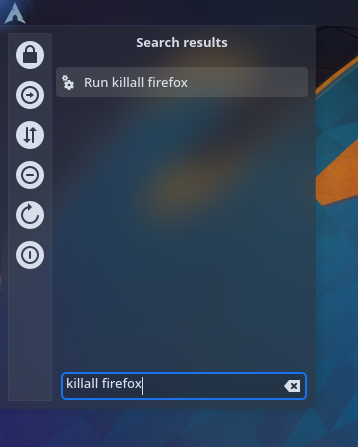
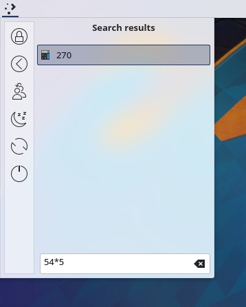
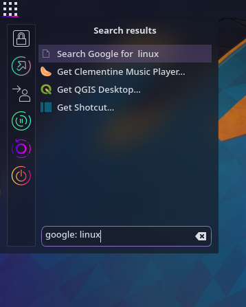
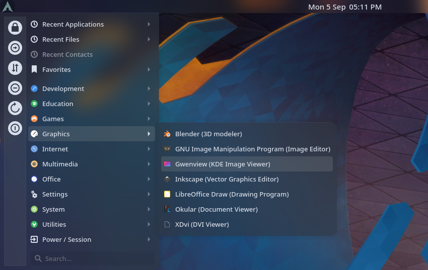
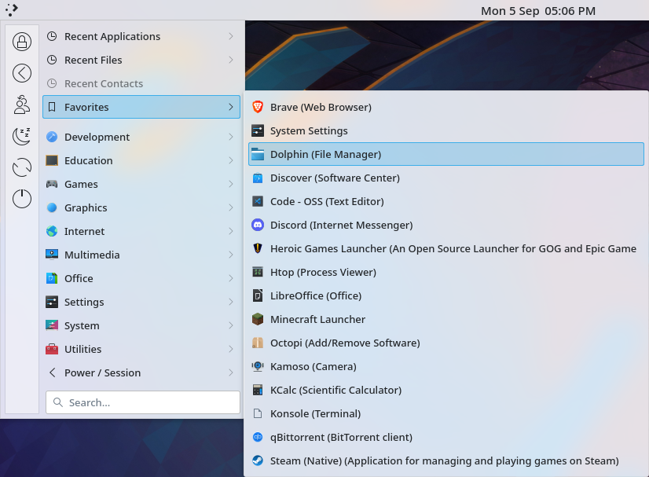
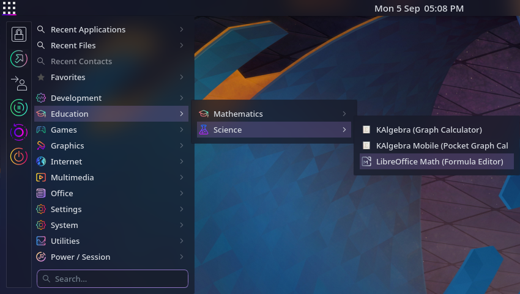

 <a href="https://himdek.com/Better-Kicker-for-Plasma/"><h1 align="center">Better Kicker</h1></a>
 
An improved fork of KDE Plasma's Kicker Application Menu

 
 
 
 
 
 
 

  
   
  
  

  
  

This is an improved fork of KDE Plasma's Kicker Application Menu which is a launcher based on cascading popup menus. The design is simplified while improving search features and customizability.

## Powerful Plasma Search

The search bar uses `Plasma Search`, which is the same search provider used in Krunner, Kickoff Application Launcher and the Overview effect which supports powerful search plugins and providers.

###### **NOTE:** The initial codebase was copied from Kicker which can be found in `/usr/share/plasma/plasmoids/org.kde.plasma.kicker/`, on every Linux system that has KDE Plasma installed.

## Prerequisites:

* Linux based Operating System
* [KDE Plasma Desktop Environment](https://kde.org/plasma-desktop/)
* [Plasma-Framework Package](https://github.com/KDE/plasma-framework)

Make sure you have plasma-framework package installed by execute the following command:

  <pre>sudo apt install plasma-framework</pre>

<h1 align="center">Get it from</h1>

  
  
  

Install it directly from any of the above mentioned sources

or

If you have download the file, extract it, open a terminal in the directory containing the `metadata.desktop` file and execute the following command:

  <pre>kpackagetool5 -t Plasma/Applet --install</pre>

## Changes made over default Kicker:

* Disabled the favorite applications shown in the side bar because the original Kicker Application Menu of KDE Plasma looks broken if too many Applications are added to favourites. Favorite applications are now shown in a dedicated menu category
* Shows all the session and power buttons viz Lock, Logout, Switch User, Sleep, Restart and Shut Down
* Ability to enable or disable the `Favorites` menu category.
* Powerfull and improved search: The search bar now supports all the features of Plasma Search or Krunner
* Unified design: Removed unnecessary separators. Every component now shares the same background and looks cleaner

<h1 id="gallery" align="center">Gallery</h1>

  

